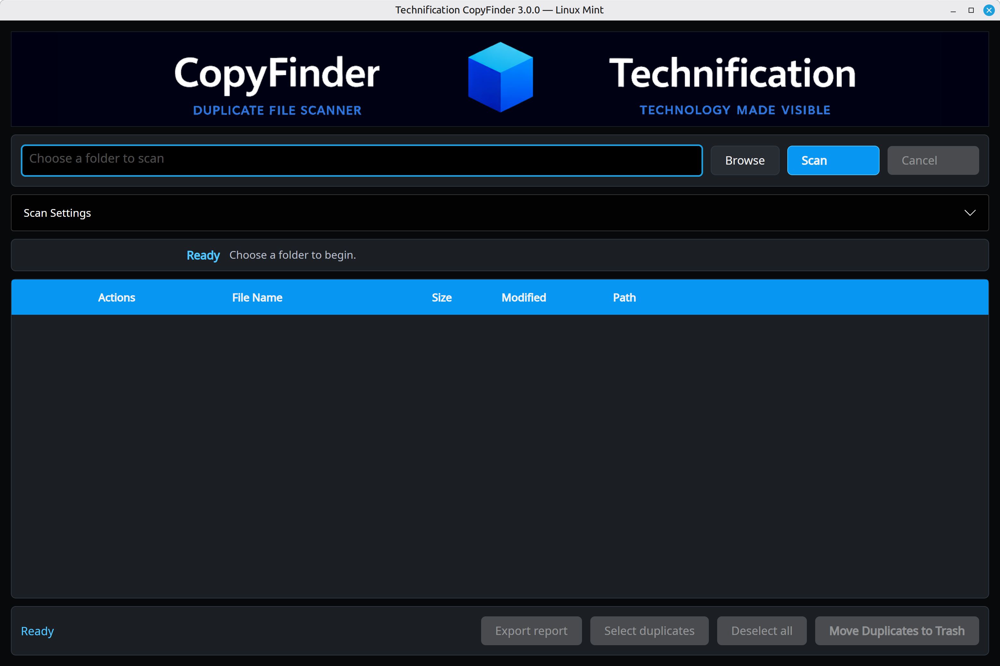

# CopyFinder — Linux Mint Edition


A Linux Mint desktop application for finding, reviewing, and safely removing duplicate files.

CopyFinder 3 preserves Dean John Weiniger's original Technification interface and product workflow while replacing the Windows implementation with .NET 10, Avalonia, XDG storage, Nemo-compatible folder opening, and GIO Trash.

> Looking for the Windows edition? Visit [CopyFinder for Windows](https://github.com/DJW1080/CopyFinder). The Windows and Linux Mint editions are maintained as separate repositories.



## 🐧 Application Behaviour

- Recursively scans a selected folder without following symbolic-link directories.
- Groups candidates by size, then verifies matching content with SHA-256.
- Chooses one file to keep using original-name, shortest-name, oldest, newest, preferred-folder, or highest-resolution rules.
- Lets you change the kept file and select duplicates by group or across the complete scan.
- Revalidates the kept file and every selected duplicate immediately before removal.
- Moves validated duplicates to the Linux desktop Trash through GIO. It never falls back to permanent deletion.
- Exports the review as CSV or JSON and opens file locations in the Mint file manager.
- Stores settings, logs, and cache files in the standard XDG user directories.

## 📦 Install a Release

The release archive is self-contained; end users do not need to install .NET.

```bash
sha256sum -c CopyFinder-v3.0.0-linux-x64.tar.gz.sha256
mkdir -p CopyFinder-v3.0.0
tar -xzf CopyFinder-v3.0.0-linux-x64.tar.gz -C CopyFinder-v3.0.0
cd CopyFinder-v3.0.0
./install.sh
```

The installer is local to your user account and never uses `sudo`. Open the Mint menu and search for **CopyFinder**. See [INSTALL.md](INSTALL.md) for update, uninstall, and data-location details.

## 🛠️ Build and Test

Requirements: Linux Mint 22.3 x86-64 and the .NET 10 SDK.

```bash
dotnet restore CopyFinder.sln
dotnet build CopyFinder.sln -c Release --no-restore -warnaserror
dotnet test CopyFinder.sln -c Release --no-build
dotnet run --project src/CopyFinder.App/CopyFinder.App.csproj
```

Create a self-contained release archive and SHA-256 checksum:

```bash
./publish.sh
```

## 🛡️ Safety and Privacy

CopyFinder operates locally. File contents are read only to calculate hashes and image dimensions; nothing is uploaded. Selected files are checked again before GIO is called, and a failed validation or failed Trash operation leaves the row and file untouched.

- Settings: `${XDG_CONFIG_HOME:-~/.config}/CopyFinder/settings.json`
- Logs: `${XDG_STATE_HOME:-~/.local/state}/CopyFinder/logs/copyfinder.log`
- Cache: `${XDG_CACHE_HOME:-~/.cache}/CopyFinder`

## 🗂️ Project Guides

- [INSTALL.md](INSTALL.md) — installation, updates, data locations, and uninstallation.
- [REPO_LAYOUT.md](REPO_LAYOUT.md) — source-code and packaging directory map.
- [CHANGELOG.md](CHANGELOG.md) — release history and verification notes.
- [Linux Mint verification](docs/verification/linux-mint-22.3.md) — tested platform behaviour and acceptance checks.

## 📝 Credits

Created and directed by **Dean John Weiniger** in Melbourne, Australia.

The original interface styling concept was developed with assistance from **GitHub Copilot**.

**Human-AI collaboration**

CopyFinder was conceived and directed by Dean John Weiniger, who designed and refined the interface and product experience. The application code was developed with assistance from ChatGPT by OpenAI. The project is presented as a demonstration of practical human-AI collaboration in desktop application development.

## 📜 Licence

This project is dedicated to the public domain under the [Creative Commons CC0 1.0 Universal License](LICENSE).
